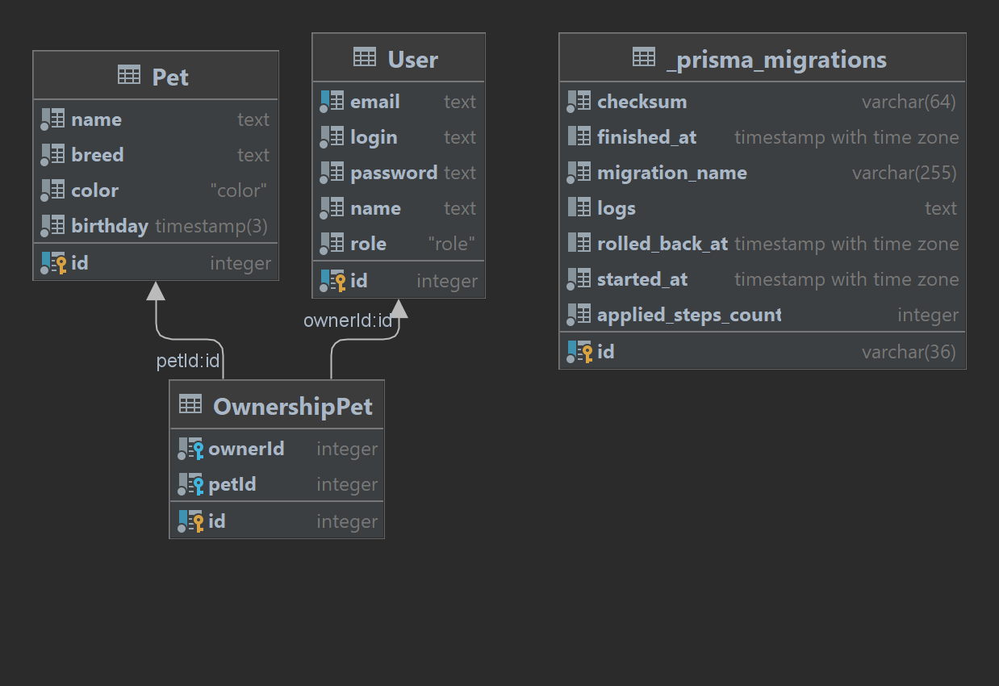

# Лабораторная работа №1
Карепин Денис Дмитриевич M33071

Приют для бездомных животных — место содержания бездомных, потерянных или брошенных животных, преимущественно собак и кошек.
ИС приюта служит для контакта между человеком, который хочет забрать животного (client) и приютом (shelter service). ИС способна упростить это взаимодействие и создать возможность дистанционного выбора животного, тем самым, увеличив количество клиентов. Каждый может зайти на сайт и увидеть список животных, которые ждут добрых хозяев, но взять питомца можно, зарегистрировавшись, присвоив себе личный ID, тем самым упростив работу приюта. При таком сценарии появляется новый функционал: просмотр уже “забронированных животных”, удобный просмотр питомцев, ждущих своих хозяев прямо на сайте, возможность вернуть взятое животное, ведь клиент уже хранится в базе данных.

Pet - питомец